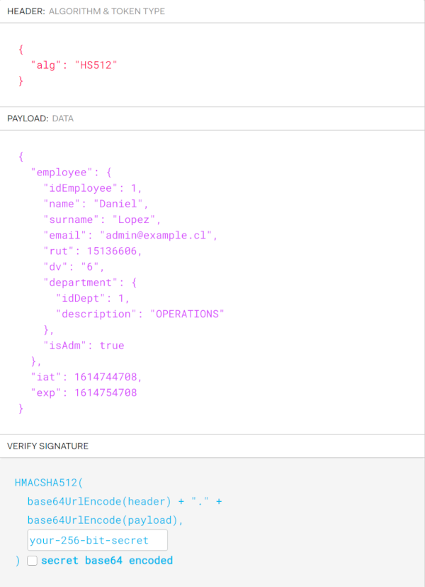
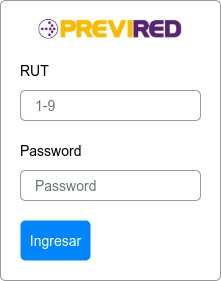
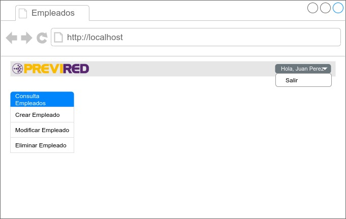

[](https://www.previred.com)

# Desafío para desarrolladores front end

## Condiciones generales
- En este repositorio existe una API de ejemplo desarrollada en Java que contiene un CRUD básico de empleados y que implementa seguridad basada en JSON Web Tokens (https://jwt.io/).
- En la carpeta "docs" se adjunta la documentación de la API en estándar OpenAPI 3.0 (formatos json y yaml para una rápida visualización en https://editor.swagger.io/).
- A grandes rasgos, los endpoints y su estructura son los siguientes:

| Método | Endpoint            | Descripción                                      | Seguridad | Perfil |
| ------ | ------------------- | ------------------------------------------------ | --------- | ------ |
| POST   | /api/token          | Obtiene un token (JWT) con credenciales básicas  | No        | N/A    |
| GET    | /api/employees      | Obtiene una lista de empleados                   | Sí        | User   |
| GET    | /api/employees/{id} | Obtiene un empleado según su ID                  | Sí        | User   |
| POST   | /api/employees      | Crea un nuevo empleado                           | Sí        | Admin  |
| PUT    | /api/employees/{id} | Actualiza un empleado según su ID                | Sí        | Admin  |
| DELETE | /api/employees/{id} | Elimina un empleado según su ID                  | Sí        | Admin  |
| GET    | /api/departments    | Obtiene una lista de departamentos/áreas         | Sí        | User   |

- Para ver el detalle, revisar el openapi mencionado anteriormente.
- El secret key de este mock es:
    - YXdlcXdxd2Vxd2Vhc2Zjc2RkYXNkYXNkcXdyZWVydGVyMTIzMTIzMTIzMTIzYXNxd2Vxd2Vxd2Vkc2ZzZGZncmRlZ2Z5aDM0NTIzNDIzYXNkMTIzNDJyZ3J0aHU0MjZ5NDV0ZnZzZGZ2c2RmZ2RmYWdmc2FkZnNk
- La estructura del token es la siguiente:



- Tener en consideración que el boolean "isAdm" identifica al tipo de usuario. True es para Admin y false para los Users.
- Para ejecutar la API, debe ejecutar el siguiente comando en su computador (debe contar con Java previamente instalado):

```
$ java -jar example-api-1.0.0.jar
```
- Por defecto, para este ejemplo la API levantará en el puerto 5000, siendo su path http://localhost:5000


## El desafío consiste en:
1. Debe implementar un formulario de login utilizando el endpoint de token descrito (mockups sólo de referencia).



2. Debe almacenar el token y obtener el tipo de usuario de este (revisar estructura).
3. Implemente un menú lateral (sidebar) que tenga listar y buscar, editar, eliminar y crear (estos últimos visibles sólo para el tipo de usuario Admin). En la parte superior agregar una barra que al costado superior derecho esté un menú tipo lista que tenga el nombre + apellido del usuario y como opción el logout (debe eliminar el token del storage).


 
4. Implemente el mantenedor con cada campo obligatorio según corresponda, además de validar el RUT bajo el módulo 11.
5. Debe validar cada código de respuesta HTTP de la API para controlar posibles errores (revise la especificación de la API).
6. Debe utilizar alguna biblioteca UI como Material UI.


## Requisitos
- Debe implementar su solución utilizando el Framework ReactJS en sus últimas versiones.
- La solución debe ser enviada vía pull request a este repositorio.
- La solución debe contener un README.md con las instrucciones para compilar e instalar.
- En el detalle del commit debes indicar los siguientes datos:
    - Nombre Completo.
    - Correo Electrónico.
    - Vía por la que te enteraste del desafío. Estas pueden ser: Empresa de outsourcing (indicar cuál), twitter, LinkedIn, etc.


## ¿Qué se busca?
- Manejo en programación funcional.
- Uso de interceptors.
- Conocimiento de códigos HTTP.
- Conocimientos de JWT.
- Uso de Localstorage.
- Uso de Hooks.
- Uso de Redux.